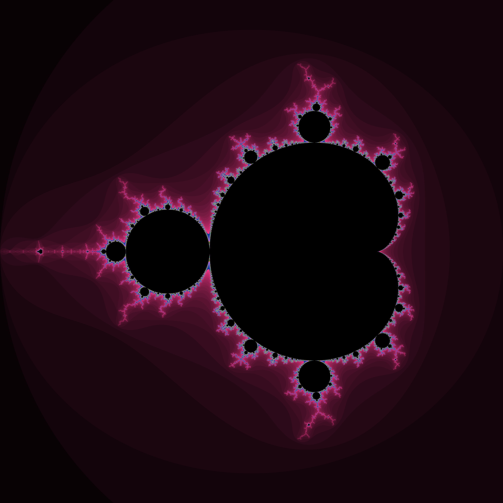

# Mandelbrot Set Fractal
This project generates a Mandelbrot set visualisation and saves it as a PPM file. The image size and maximum iterations can be customised to achieve different levels of detail. 

## Requirements
* C++ compiler (e.g., `g++`)
* A terminal to run the program

## Compilation
##### To compile the program using `g++`, run:
`g++ -o mandelbrot main.cpp`

## Execution
##### Execute the compiled program with:
`./mandelbrot`  

## Preview

